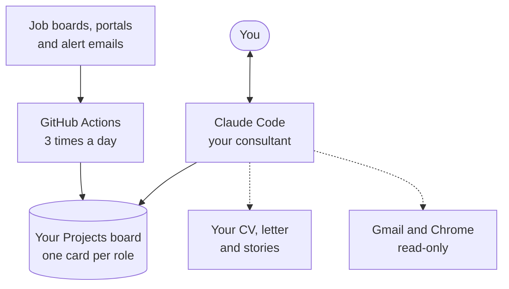
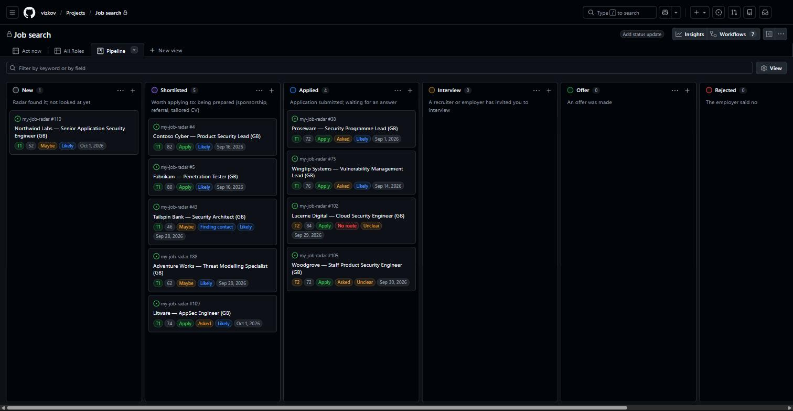
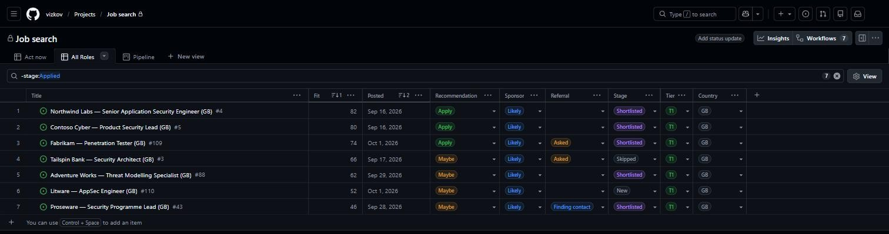

  

  
  
  
  
  
  

**job-radar finds the roles, Claude runs the search.** Three times a day it checks company job boards and public
job portals, keeps what matches, rates it, flags visa sponsors, and drops each new role on a GitHub Projects
board. You then just talk to Claude: it scores roles against your CV, tailors a CV and cover letter for each one,
checks sponsorship, finds recruiters and hiring managers and drafts your outreach, fills in forms for you to review,
reads your inbox for replies and tracks every application.

> [!NOTE]
> It ships tuned for **AppSec, product security, pentest and security-consulting roles in Europe**, because that is
> what it was built for. Titles, countries and companies are settings Claude changes for you. Making the whole
> system work for any profession and country is tracked in [#1](https://github.com/vizkov/job-radar/issues/1).

## How it works

You use it through **two things only**: a conversation with Claude, and the board. No scripts to run, no settings
files to edit, no API key (it runs on your Claude subscription).

## What you can ask Claude

| You say | What happens |
|---|---|
| "What's new?" | A briefing: new roles, best matches, anything broken, what is waiting on you |
| "Which of these fit me?" | Each role is scored against your CV with met and missing requirements, blockers and a recommendation: Apply, Maybe or Skip |
| "Tailor my CV for this role" | A CV and cover letter built from **your own lines**, checked by code, then reviewed by four fresh readers. [Details below](#your-cv-cover-letter-and-stories) |
| "Will they sponsor?" | A verdict with evidence: the ad, the country's rules, the UK and NL sponsor registers and the company's own pages |
| "Who can refer me?" | Finds the likely hiring manager and recruiter, and drafts the connection note and referral message. [Details below](#recruiters-hiring-managers-and-referrals) |
| "Help me apply" | Pre-fills the application form in your Chrome, page by page. You approve every value and click Submit |
| "Did anyone reply?" | Reads your inbox through the Gmail connector (read-only) for rejections, interviews and offers and suggests board updates |
| "Prep me for the interview" | Likely questions built from the job description, answer outlines from your own stories, questions to ask |
| "Check LinkedIn posts" | Finds hiring posts by recruiters and managers that job boards miss (opt-in) |
| "Which skills am I missing?" | Compares what your target roles keep asking for with your CV and suggests what to strengthen |
| "Too much noise" | Retunes titles, countries, companies and weights, and shows the effect before saving |
| "Is anything broken?" | Diagnoses silent sources, failed runs and missing cards, and fixes them |

Each of these is a **skill**: a packaged routine Claude follows. They are listed below, and `/manual` prints the
current list live.

<b>All the skills</b>

| Skill | What it does |
|---|---|
| `setup` | First-time setup: profile, career documents, target companies, sponsor registers, board, optional alert emails, and switching on the daily run |
| `consultant-brief` | The briefing: new roles since last time, best matches, pipeline status, anything broken |
| `score-roles` | Scores job descriptions against your CV (fit, met and missing requirements, blockers) and puts the result on the board |
| `sponsorship-check` | Decides whether an employer will actually sponsor a work visa for a role, with evidence recorded on the card |
| `referrals` | Finds a referral route in your order (people you know first, then recruiters and hiring managers), drafts messages to strangers and tracks every ask |
| `tailor-application` | Builds a tailored, ATS-safe CV and cover letter from your own career documents, validates them and renders two PDFs in your layout |
| `application-review` | Reviews CV, cover letter and stories as a set with four fresh read-only readers (ATS, recruiter, consistency auditor, copy editor) |
| `master-update` | After your master documents change, re-checks them for consistency and refreshes every application built from the old versions |
| `apply-assist` | Pre-fills an application form in your Chrome, page by page; you approve every value and click Submit |
| `inbox-check` | Reads your inbox (read-only) for rejections, interviews and offers and suggests board updates for you to confirm |
| `track` | Moves a card along the board when you report progress: shortlisted, applied, interview, offer, rejected, skipped |
| `interview-prep` | Likely technical and behavioural questions, answer outlines from your own stories, questions to ask, company context |
| `post-discovery` | Finds roles announced in LinkedIn hiring posts and reposts, traces them to the original author and turns new ones into cards (opt-in) |
| `cv-review` | Compares what your target roles keep asking for with your CV and suggests improvements, missing evidence and worthwhile certifications |
| `tune-radar` | Changes what the radar looks for (titles, exclusions, countries, companies, sources, weights) and shows the effect before saving |
| `health` | Diagnoses and fixes silent or failing sources, failed workflow runs and cards that don't appear |
| `manual` | Shows every capability, generated live from the skills and tools so it is always current |

## Your CV, cover letter and stories

This is the heart of the system. You keep three **master documents** in your private copy, and everything Claude
writes for an application comes from them:

| Master document | What it holds |
|---|---|
| **Master CV** | Every line of your experience, each with an ID, in an extensive, unpolished log |
| **Cover-letter blocks** | Reusable paragraphs: why you, why this kind of company, proof points |
| **STAR stories** | Full-detail stories (situation, task, action, result) that back every claim and feed interview prep |

**Tailoring** (`tailor-application`) picks and reorders lines from those documents for one role, and rewords them in the
job description's own vocabulary only where your stories support it. It cannot invent anything:

- **Code checks it.** Every line must trace to a master ID. New employers, numbers, links, skills or contact details are
  rejected, and a form-and-style linter enforces section rules (length, register, no filler).
- **Four fresh readers review it** (`application-review`): an ATS, a recruiter, a consistency auditor and a copy editor,
  plus a cross-check that the CV, letter and stories agree with each other.
- **You get two PDFs per application**, a two-page CV and a one-page cover letter, laid out like your own documents.

**Edit a master document and everything stays in step.** `master-update` re-checks the three documents as a set and
refreshes every application built from the old versions, so no old CV is left saying something your masters no longer say.
New facts you tell Claude go into your stories as dated "Also true" lines, so the CV, letter and stories never disagree.

Your **standing answers to application forms** (notice period, sponsorship, work authorisation, consent, voluntary
demographics) are saved once and reused, and your stories are the raw material for interview preparation.

## Recruiters, hiring managers and referrals

For a role you want, `referrals` works out who could help, in your order:

1. **People you know first** (a names-and-companies list you keep), asked before you apply.
2. **Recruiters and hiring managers next.** In your own logged-in Chrome (opt-in, read-only, one company for one role) it
   searches for the likely hiring manager and the right recruiter, checks the evidence that they hire for this kind of
   role and in this region, and suggests one of each with the reasoning. It never clicks Connect, Message or Follow.
3. **It drafts the message in the chat**: a connection-request note and a referral request, written from your own CV
   lines and checked against the job description. Recruiters hear from you after you have applied, with your tailored CV
   attached, so the note is about a role you have already applied for. You copy it and send it yourself.

Every ask and answer is tracked on the card (Finding contact, Asked, Referred, No route, Not needed), and the session brief
reminds you about asks nobody has answered.

## Gmail, two ways

| | Alert mailbox | Claude's Gmail connector |
|---|---|---|
| **For** | Getting LinkedIn, Indeed and Glassdoor jobs without scraping them | Spotting replies to your applications |
| **How** | A dedicated Gmail account receives your job-alert emails. The daily GitHub run reads it with an app password stored as a repository secret, and checks each email is genuine | Claude's Gmail connector, **read-only**: it searches and reads, and never sends, replies, labels or deletes |
| **When** | Three times a day, on its own | While a Claude session is open |
| **What you get** | New roles on your board | Suggested Rejected, Interview or Offer updates for you to confirm |

## The board

One card per role, moving **New → Shortlisted → Applied → Interview → Offer** (or Rejected or Skipped). Each card
carries:

| Field | Meaning |
|---|---|
| Stage | Where the role is in your pipeline |
| Tier | T1 apply early, T2 lower priority. A rule-based guess at first; once scored, Apply makes it T1 and Skip makes it T2 |
| Fit and Recommendation | The score against your CV (0 to 100) and Apply, Maybe or Skip |
| Sponsor | Visa sponsorship: register match first, then Confirmed, Likely or No after a sponsorship check |
| Country, Posted, Referral | Where, when the ad went up, and how the referral ask is going |

The views are code, so every copy gets the same ones: **All Roles**, **Act now** (open roles that are new or
about to expire) and **Pipeline**.

  
   The Pipeline view. Each column says what the stage means. Company and role names are replaced with fictional ones for this picture.

  
   The All Roles view, sorted by fit. Names replaced with fictional ones.

<b>Quieter features that run in the background</b>

- **Scores the freshest roles for you** at the start of each session, so there is something to read before you ask.
- **Tunes itself, visibly.** Once a week the rule-based tier weights are nudged by how your fit scores came out, and
  the change is reported with a one-line undo.
- **Notices closed ads.** A role no source lists any more is flagged `possibly-closed`, drops out of "Act now" and is
  proposed for Skipped, then archived.
- **Nudges you on silence.** Applications with no change for too long come back as a follow-up in the briefing.
- **Reads the language.** An ad written in, or requiring, a language you don't work in becomes a blocker.
- **Keeps an eye on itself.** It checks its own sources, runs and board views on a schedule and tells you what is due,
  so nothing runs silently.
- **Treats ads as data.** Job descriptions and emails can't give it instructions, and instruction-like text in one is
  flagged to you.

## What it will never do

- **Log in to a job portal for you, or scrape LinkedIn, Indeed or Glassdoor.** Their own alert emails are read
  instead. Two opt-in LinkedIn exceptions are read-only, one page at a time, in your own browser.
- **Submit an application, or email or message anyone.** It can pre-fill a form and draft a note; you click Submit and Send.
- **Invent experience.** Tailored CVs only reuse your own lines, and code rejects anything that isn't traceable to them.
- **Publish your job search.** It runs from a private copy; this public repo holds code only.
- **Follow instructions hidden in a job ad.** Ads and alert emails are treated as data, never as commands.

<b>Where roles come from</b>

| Source | Covers |
|---|---|
| Company job boards (Greenhouse, Workday, Lever, Ashby and more) | Every verified employer board you track |
| Careers pages | Employers without a standard job board |
| Bundesagentur, JobTech, EURES | Germany, Sweden and EU-wide public employment services |
| Reed | UK board, official API (optional) |
| Job-alert emails | LinkedIn, Indeed and Glassdoor alerts, read from a dedicated mailbox (optional) |
| LinkedIn hiring posts | Roles announced by recruiters and managers, read in your own browser (opt-in) |

Roles are de-duplicated across sources, rated by fixed rules (no AI judges each ad), matched to the UK and NL
sponsor registers, and aged out when no source lists them any more.

<b>What it costs and what it needs</b>

- A Claude subscription (Pro or Max). There is no separate API bill.
- A free GitHub account. The daily runs use roughly 450 to 750 of the 2,000 free Actions minutes a month.
- A private GitHub repository for your copy, a GitHub Projects board, and Chrome if you want form filling.

## Get started

1. Make a **private** copy: clone this repo, rename the remote to `template`, and push to a new empty private repo.
   Don't fork: a fork of a public repo can't be private. Exact commands:
   [Setup and publishing](docs/design/14-Setup-and-publishing.md).
2. Open **Claude Code** in that folder and say **"set this up for me"**.

Claude asks only for what it can't do itself: your CV and preferences, one GitHub login, two clicks on the board and,
optionally, a mail secret.

## Documentation

| If you want to… | Read |
|---|---|
| use it | the user guide: [docs/wiki](docs/wiki/Home.md) (also in this repo's Wiki tab) |
| understand how it works, file by file | the design docs: [docs/design](docs/design/README.md) |
| check what protects your data and accounts | [Security model](docs/design/13-Security-model.md) |
| see what is planned | the open [issues](https://github.com/vizkov/job-radar/issues): [#1](https://github.com/vizkov/job-radar/issues/1) works for any profession and country, [#2](https://github.com/vizkov/job-radar/issues/2) versioned releases and safe updates |

## Licence

[MIT](LICENSE): use it, change it, share it. Your own search data never enters this repo: it lives in your private copy.

## Credits

Built on [ats-scrapers](https://github.com/kalil0321/ats-scrapers) (fetching company job boards) and company-to-board
mappings from ats-scrapers and [job-board-aggregator](https://github.com/Feashliaa/job-board-aggregator).
