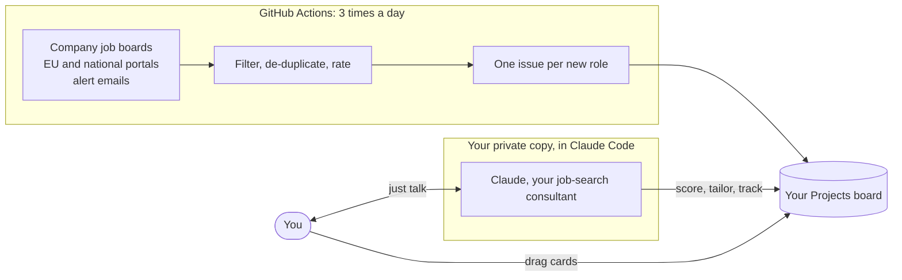

  

  
  
  
  
  

**job-radar finds the roles, Claude runs the search.** Three times a day it checks company job boards and public
job portals, keeps what matches, rates it, flags visa sponsors, and drops each new role on a GitHub Projects
board. You then just talk to Claude: it scores roles against your CV, tailors a CV and cover letter for each one,
checks sponsorship, finds a referral route, fills in forms for you to review and tracks every application.

> [!NOTE]
> It ships tuned for **AppSec, product security, pentest and security-consulting roles in Europe**, because that is
> what it was built for. Titles, countries and companies are settings Claude changes for you. Making the whole
> system work for any profession and country is tracked in [#1](https://github.com/vizkov/job-radar/issues/1).

## How it works

You use it through **two things only**: a conversation with Claude, and the board. No scripts to run, no settings
files to edit, no API key (it runs on your Claude subscription).

## What you can ask Claude

| You say | What happens |
|---|---|
| "What's new?" | A briefing: new roles, best matches, anything broken, what is waiting on you |
| "Which of these fit me?" | Each role is scored against your CV with met and missing requirements, blockers and a recommendation: Apply, Maybe or Skip |
| "Tailor my CV for this role" | A two-page CV and a one-page cover letter built from **your own lines**, checked by code so nothing is invented, then reviewed by four fresh readers (ATS, recruiter, consistency, copy editor) |
| "Will they sponsor?" | A verdict with evidence: the ad, the country's rules, the UK and NL sponsor registers and the company's own pages |
| "Who do I know there?" | Referral routes: people you know first, then recruiters and hiring managers, with drafts for you to send |
| "Help me apply" | Pre-fills the application form in your Chrome, page by page. You approve every value and click Submit |
| "Did anyone reply?" | Reads your inbox (read-only) for rejections, interviews and offers and suggests board updates |
| "Prep me for the interview" | Likely questions built from the job description, answer outlines from your own stories, questions to ask |
| "Check LinkedIn posts" | Finds hiring posts by recruiters and managers that job boards miss (opt-in) |
| "Which skills am I missing?" | Compares what your target roles keep asking for with your CV and suggests what to strengthen |
| "Too much noise" | Retunes titles, countries, companies and weights, and shows the effect before saving |
| "Is anything broken?" | Diagnoses silent sources, failed runs and missing cards, and fixes them |

Each of these is a **skill**: a packaged routine Claude follows. There are nineteen, listed below, and `/manual` prints
the current list live.

<b>All 19 skills</b>

| Skill | What it does |
|---|---|
| `setup` | First-time setup: profile, career documents, target companies, sponsor registers, board, optional alert emails, and switching on the daily run |
| `consultant-brief` | The briefing: new roles since last time, best matches, pipeline status, anything broken |
| `score-roles` | Scores job descriptions against your CV (fit, met and missing requirements, blockers) and puts the result on the board |
| `sponsorship-check` | Decides whether an employer will actually sponsor a work visa for a role, with evidence recorded on the card |
| `referrals` | Finds a referral route in your order (people you know first, then recruiters and hiring managers), drafts messages to strangers and tracks every ask |
| `tailor-application` | Builds a tailored, ATS-safe CV and cover letter from your own career documents, validates them and renders two PDFs in your layout |
| `application-review` | Reviews CV, cover letter and stories as a set with four fresh read-only readers (ATS, recruiter, consistency auditor, copy editor) |
| `master-update` | After your master documents change, re-checks them for consistency and refreshes every application built from the old versions |
| `apply-assist` | Pre-fills an application form in your Chrome, page by page; you approve every value and click Submit |
| `inbox-check` | Reads your inbox (read-only) for rejections, interviews and offers and suggests board updates for you to confirm |
| `track` | Moves a card along the board when you report progress: shortlisted, applied, interview, offer, rejected, skipped |
| `interview-prep` | Likely technical and behavioural questions, answer outlines from your own stories, questions to ask, company context |
| `post-discovery` | Finds roles announced in LinkedIn hiring posts and reposts, traces them to the original author and turns new ones into cards (opt-in) |
| `cv-review` | Compares what your target roles keep asking for with your CV and suggests improvements, missing evidence and worthwhile certifications |
| `tune-radar` | Changes what the radar looks for (titles, exclusions, countries, companies, sources, weights) and shows the effect before saving |
| `health` | Diagnoses and fixes silent or failing sources, failed workflow runs and cards that don't appear |
| `system-review` | A weekly review of sources, coverage gaps, noisy filters and unused features, with a ranked list of fixes to approve |
| `docs-review` | Tests the documentation by having two fresh readers read it cold, then fixes what they found |
| `manual` | Shows every capability, generated live from the skills and tools so it is always current |

## The board

One card per role, moving **New → Shortlisted → Applied → Interview → Offer** (or Rejected or Skipped). Each card
carries:

| Field | Meaning |
|---|---|
| Stage | Where the role is in your pipeline |
| Tier | T1 apply early, T2 lower priority. A rule-based guess at first; once scored, Apply makes it T1 and Skip makes it T2 |
| Fit and Recommendation | The score against your CV (0 to 100) and Apply, Maybe or Skip |
| Sponsor | Visa sponsorship: register match first, then Confirmed, Likely or No after a sponsorship check |
| Country, Posted, Referral | Where, when the ad went up, and how the referral ask is going |

The views are code, so every copy gets the same ones: **All Roles**, **Act now** (open roles that are new or
about to expire) and **Pipeline**.

## What it will never do

- **Log in to a job portal for you, or scrape LinkedIn, Indeed or Glassdoor.** Their own alert emails are read
  instead. Two opt-in LinkedIn exceptions are read-only, one page at a time, in your own browser.
- **Submit an application, or email or message anyone.** It can pre-fill a form; you click Submit.
- **Invent experience.** Tailored CVs only reuse your own lines, and code rejects anything that isn't traceable to them.
- **Publish your job search.** It runs from a private copy; this public repo holds code only.
- **Follow instructions hidden in a job ad.** Ads and alert emails are treated as data, never as commands.

<b>Where roles come from</b>

| Source | Covers |
|---|---|
| Company job boards (Greenhouse, Workday, Lever, Ashby and more) | Every verified employer board you track |
| Careers pages | Employers without a standard job board |
| Bundesagentur, JobTech, EURES | Germany, Sweden and EU-wide public employment services |
| Reed | UK board, official API (optional) |
| Job-alert emails | LinkedIn, Indeed and Glassdoor alerts, read from a dedicated mailbox (optional) |

Roles are de-duplicated across sources, rated by fixed rules (no AI judges each ad), matched to the UK and NL
sponsor registers, and aged out when no source lists them any more.

<b>What it costs and what it needs</b>

- A Claude subscription (Pro or Max). There is no separate API bill.
- A free GitHub account. The daily runs use roughly 450 to 750 of the 2,000 free Actions minutes a month.
- A private GitHub repository for your copy, a GitHub Projects board, and Chrome if you want form filling.

## Get started

1. Make a **private** copy: clone this repo, rename the remote to `template`, and push to a new empty private repo.
   Don't fork: a fork of a public repo can't be private. Exact commands:
   [Setup and publishing](docs/design/14-Setup-and-publishing.md).
2. Open **Claude Code** in that folder and say **"set this up for me"**.

Claude asks only for what it can't do itself: your CV and preferences, one GitHub login, two clicks on the board and,
optionally, a mail secret.

## Documentation

| If you want to… | Read |
|---|---|
| use it | the user guide: [docs/wiki](docs/wiki/Home.md) (also in this repo's Wiki tab) |
| understand how it works, file by file | the design docs: [docs/design](docs/design/README.md) |
| check what protects your data and accounts | [Security model](docs/design/13-Security-model.md) |
| see what is planned | the open [issues](https://github.com/vizkov/job-radar/issues): [#1](https://github.com/vizkov/job-radar/issues/1) works for any profession and country, [#2](https://github.com/vizkov/job-radar/issues/2) versioned releases and safe updates |

## Credits

Built on [ats-scrapers](https://github.com/kalil0321/ats-scrapers) (fetching company job boards) and company-to-board
mappings from ats-scrapers and [job-board-aggregator](https://github.com/Feashliaa/job-board-aggregator).
